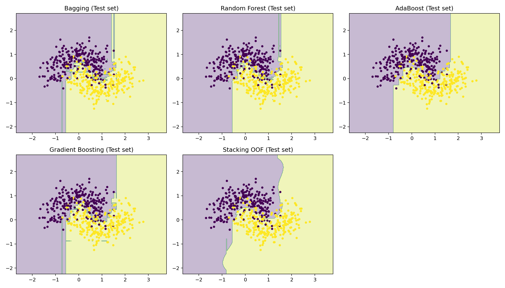

# Stacking Ensemble Lab (OOF Stacking)

This repository demonstrates a complete **ensemble learning** workflow on the
classic `make_moons` dataset, including:

- Bagging
- Random Forest (with Out-of-Bag evaluation)
- AdaBoost
- Gradient Boosting
- Manual **Out-of-Fold (OOF) Stacking**

The goal is to clearly show how stacking works internally by generating meta-features
from base learners and training a meta-model on top.

---

##  Output Example

Decision boundaries produced by each ensemble method:



---

##  Installation

Clone the repository and install dependencies:

```bash
pip install -r requirements.txt

